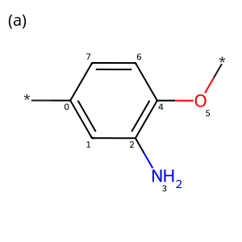
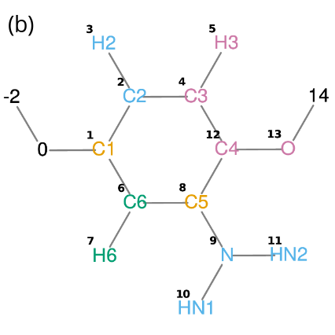

# Instructions for Use
- For testing purposes, a lower number of configurations, set by `-n_conf`, can be used to accelerate the parametrization process. For example, a value around 10 might be sufficient.

- For production runs, several hundred up to a thousand conformers might be required. This depends on the number of fragments in the molecules and the convergence behavior of the bonded interactions (see Figure 5 in Dettmann et al., 2024a, DOI: 10.1021/acs.jctc.4c01334).

- To speed up the parametrization, use more threads by applying the `-nt` flag.

- The `-map` option allows you to choose between center-of-geometry (COG) and center-of-mass (COM) mapping.

- By using `-parametrize no`, the generation of the `.itp` files can be skipped. In this case, SOM2CG will only output the coordinate file(s), which is useful if, for example, you are considering different water contents for the same system and only need to generate the `.itp` files once.

- The `-solvate yes` option enables on-the-fly solvation of the system at the end. Note, however, that using `gmx solvate` might yield better performance.

- When using `-use_std_fc yes`, standard force constants for bonds and angles are applied. This can help mitigate numerical instabilities in the simulation.

- The `-with_progress_bar no` option deactivates the tqdm progress bar, which improves visibility when output is redirected to a file.

- All of the above options can also be included in a YAML file and read by SOM2CG with the `-config` flag.

- Please consider using the `.mdp` files provided in the repository. These allow, for example, the use of the `define = -Dmin` option for better conversion during the energy minimization step.

# Possible Improvements
- **GROMACS Stability**:  
    Numerical stability issues have been observed with GROMACS versions later than 2019.
- **Bead Type Fine-Tuning**:  
    Fine-tuning the bead types could improve the model further, particularly regarding the octanol–water free energies. This issue might partly stem from the (phenol) Martini beads not accurately reproducing these values. (See Figure S5 in the Supporting Information of Dettmann et al., 2024b, DOI: 10.1021/acs.jctc.4c00332; note that while some fragments align well with hexadecane–water and chloroform–water free energies, discrepancies with the octanol–water values can be quite pronounced.)
- **Enhanced Bead Type and Bonded Interaction Database**:  
    For optimal accuracy, an extended database of bonded interactions is required. This should include parameters for fragment–fragment connections and cover all instances of fragments having additional hydrogen atoms or methyl groups attached at either end. With such an expanded database in place, the current RDKit conformer search could potentially become obsolete.
    A similar extension is necessary for the database of bead types to address cases involving additional hydrogen atoms and methyl groups attached to the fragments.

# Instruction for adding a new fragment to SOM2CG
- If new fragments are added to the VSOMM2, the fragment database of SOM2CG has to be updated.

- **Define Fragment Properties:**  
  First, define a mapping, bead types, bonded interactions, and their parameters.  
  The mapping and bead types may be obtained from already implemented Martini coarse‑grained molecules. Alternatively, bead types might be determined using partitioning free energies, and bonded interaction parameters can be obtained from tools like Swarm‑CG (https://github.com/GMPavanLab/Swarm-CG) or Bartender (https://github.com/Martini-Force-Field-Initiative/Bartender).

- **Provide SMILES Code:**  
  You also need a representative SMILES code for the new fragment.

- **Create an RDKit Molecule:**  
  **Important:** Create a molecule in RDKit using the SMILES code and obtain the indices for each atom. You will later compare these indices to the corresponding ones of the VSOMM2 fragment representation (see the figures below).

- **Ensure Matching Atom Order:**  
  The SMILES should be designed so that the first atom in the RDKit fragment matches the first atom in the VSOMM2 fragment (i.e. start with the same atom).

- **Update the `fragment_data.py` File:**  
  Include the following information:

  1. **SMILES Dictionary:**  
     - Add the SMILES code.

  2. **fragments_mapping:**  
     - Add the indices of the VSOMM2 atoms (represented by a bead).  
       *(Each list of indices corresponds to one bead, and the order of these lists must match the bead indices of the coarse‑grained fragments.)*

  3. **fragments_connections:**  
     - Define the bonds for the coarse‑grained fragments.  
       *(Each bond is represented by a list of the corresponding indices, starting from zero.)*

  4. **fragments_bond_fc:**  
     - Specify the force constants for the bonds.  
       *(A value of `None` indicates that the bond is represented by a constraint.)*

  5. **fragments_angle_fc:**  
     - Provide a dictionary defining the angles of the coarse‑grained fragment.  
       *(Each entry consists of indices (starting from zero) and the corresponding force constants.)*

  6. **fragments_dihedral_fc:**  
     - Similarly, specify the force constants for the dihedral angles.  
       *(Note that the equilibrium distances and angles are determined by RDKit.)*

  7. **fragments_exclusions:**  
     - Define the exclusions for the coarse‑grained fragment.  
       *(Each list appears as a line in the final `.itp` file, with indices starting from one.)*

  8. **fragments_lengths:**  
     - Specify the number of beads in the fragment (including virtual sites; this could theoretically be obtained automatically from elsewhere).

  9. **fragments_bead_types:**  
     - List the bead types for the beads in the coarse‑grained fragment.  
       *(The order must correspond to the bead indices.)*

  10. **fragments_charges:**  
      - Similarly, provide the charges for the beads.

  11. **fragments_vs:**  
      - Define the virtual sites within the fragment.  
        *(The keys in this dictionary represent the virtual sites. Each value is another dictionary that maps the constructing particles to their weights. Depending on the number of constructing particles, different functional forms are used (either `virtual_sites2`, `virtual_sites3`, or `virtual_sitesn`). For the first two forms, you need one weight value less than the number of constructing particles; hence, a zero is included in the dictionary. Indices start at zero.)*

  12. **fragments_modify_first:**  
      - Modify the bead types if the fragment is at the beginning of the molecule (e.g., when a hydrogen is added to the underlying atomistic structure).  
        *(For instance, an aromatic bead with no hydrogens (`TC5e`) will be converted to a normal `TC5` bead.)*

  13. **fragments_modify_last:**  
      - Apply a similar modification for beads at the end of the fragment.  
        *(The keys indicate the bead’s position within the fragment (i.e. its location in the index list) since it does not need to be the very last one. Note that Swarm‑CG only works if virtual sites are placed at the end of the bead list. For example, selecting the last bead might be denoted as `-1`. In the case of the `HS12` fragment, two virtual sites follow the last bead (where a hydrogen or carbon would normally be attached), so the position of the last bead is `-3`.)*  
      The following entries are used to assign bead types depending on whether a hydrogen or a carbon is attached:
      - **FRG_O:** Add the fragment to the list if its last atom is an oxygen.
      - **FRG_same:** Add the fragment to the list if the first bead of the fragment is also connected to the next fragment (but do not add it if it is a single‑bead fragment).

  14. **fragments_vsomm_indices:**  
      - Provide lists to translate RDKit atom indices to the corresponding VSOMM2 indices.  
        *(The position of a VSOMM2 index in the list corresponds to the RDKit atom index. This is connected with the SMILES defined for each fragment.)*  
      For example, consider the `HS2` fragment (see Figure below):  
      ```
      'HS2': [1, [6, 7], 8, [9, 10, 11], 12, 13, [4, 5], [2, 3]]
      ```  
      This means that atom indices 0, 1, 2, 3, 4, … in the RDKit molecule are assigned the corresponding VSOMM2 indices: 1, [6, 7], 8, [9, 10, 11], 12, …  
      *(A single RDKit atom may correspond to multiple VSOMM2 atoms (e.g. in groups like OH or NH₂) because RDKit represents them with one atom index.)*

- **Figure: Comparison of RDKit and VSOMM2 Representations**  



  *Comparison of the molecular representations of RDKit (a) and VSOMM2 (b) for the HS2 fragment. Placeholder atoms (\*) are added to the original SMILES of HS2 for easier comparison. Note that while hydrogens influence the determination of bonded interaction parameters in RDKit, they are not taken into account in the translation from RDKit to VSOMM2.*

